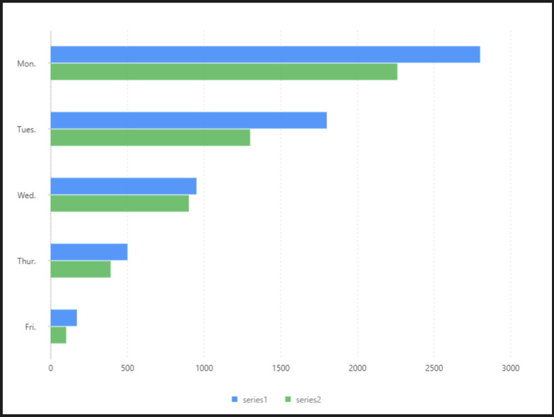

# 分組條形圖

### 圖片預覽



### 資料源

```javascript
[{
  "label": "Mon.",
  "type": "series1",
  "value": 2800
}, {
  "label": "Mon.",
  "type": "series2",
  "value": 2260
}, {
  "label": "Tues.",
  "type": "series1",
  "value": 1800
}, {
  "label": "Tues.",
  "type": "series2",
  "value": 1300
}, {
  "label": "Wed.",
  "type": "series1",
  "value": 950
}, {
  "label": "Wed.",
  "type": "series2",
  "value": 900
}, {
  "label": "Thur.",
  "type": "series1",
  "value": 500
}, {
  "label": "Thur.",
  "type": "series2",
  "value": 390
}, {
  "label": "Fri.",
  "type": "series1",
  "value": 170
}, {
  "label": "Fri.",
  "type": "series2",
  "value": 100
}]
```


### 內距

```javascript
40, 60, 80, 70
```


### 軸座標 Axis

#### value（ Y軸 ）

| 列表 | 設定值 |
| :--- | :--- |
| 欄位 | value |
| 啟用 | 開啟 |
| 位置 | right |


### 圖 Geom

#### 柱狀圖（ interval ）

| 列表 | 設定值 |
| :--- | :--- |
| 欄位 | label\*value |
| 類型 | 柱狀圖 |
| 顏色欄位 | type |
| 調整欄位 | 分組 \| dodge |
| dodgeRatio | 0.35 |
| marginRatio | 0.5 |


### 圖示 Legend

| 列表 | 設定值 |
| :--- | :--- |
| 啟用 | 開啟 |
| 欄位 | type |
| 位置 | 下 |
| 排版 | 水平 |


### 極坐標 Coord

| 列表 | 設定值 |
| :--- | :--- |
| 類型 | 直角坐標系 |
| 反轉 | Y |
| 轉置 | true |




