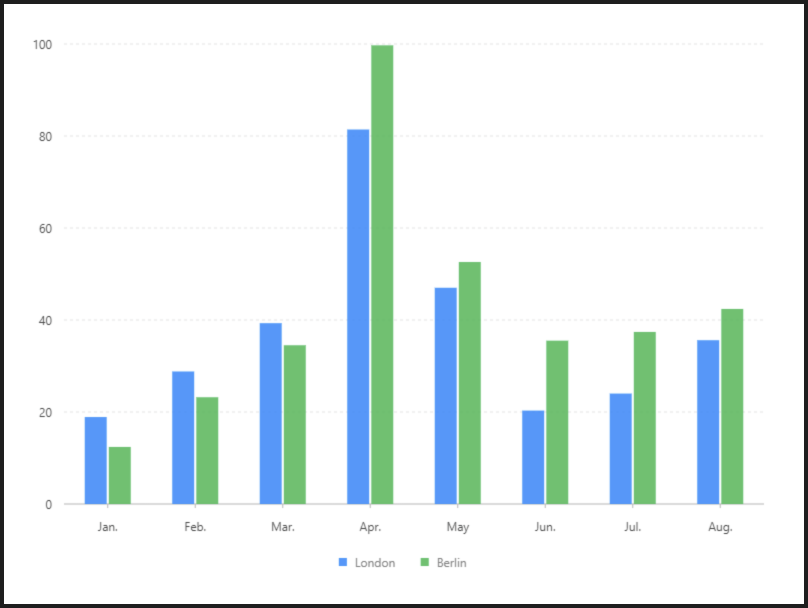

# 分組柱狀圖

### 圖片預覽




### 資料源

```javascript
[{
  "name": "London",
  "月份": "Jan.",
  "月均降雨量": 18.9
}, {
  "name": "London",
  "月份": "Feb.",
  "月均降雨量": 28.8
}, {
  "name": "London",
  "月份": "Mar.",
  "月均降雨量": 39.3
}, {
  "name": "London",
  "月份": "Apr.",
  "月均降雨量": 81.4
}, {
  "name": "London",
  "月份": "May",
  "月均降雨量": 47
}, {
  "name": "London",
  "月份": "Jun.",
  "月均降雨量": 20.3
}, {
  "name": "London",
  "月份": "Jul.",
  "月均降雨量": 24
}, {
  "name": "London",
  "月份": "Aug.",
  "月均降雨量": 35.6
}, {
  "name": "Berlin",
  "月份": "Jan.",
  "月均降雨量": 12.4
}, {
  "name": "Berlin",
  "月份": "Feb.",
  "月均降雨量": 23.2
}, {
  "name": "Berlin",
  "月份": "Mar.",
  "月均降雨量": 34.5
}, {
  "name": "Berlin",
  "月份": "Apr.",
  "月均降雨量": 99.7
}, {
  "name": "Berlin",
  "月份": "May",
  "月均降雨量": 52.6
}, {
  "name": "Berlin",
  "月份": "Jun.",
  "月均降雨量": 35.5
}, {
  "name": "Berlin",
  "月份": "Jul.",
  "月均降雨量": 37.4
}, {
  "name": "Berlin",
  "月份": "Aug.",
  "月均降雨量": 42.4
}]
```


### 內距

```javascript
40, 40, 100, 60
```


### 圖 Geom

#### 柱狀圖（ interval ）

| 列表 | 設定值 |
| :--- | :--- |
| 欄位 | 月份\*月均降雨量 |
| 類型 | 柱狀圖 |
| 顏色欄位 | name |
| 調整欄位 | 分組 \| dodge |
| dodgeRatio | 0.5 |
| marginRatio | 0.1 |


### 圖示 Legend

| 列表 | 設定值 |
| :--- | :--- |
| 啟用 | 開啟 |
| 欄位 | name |
| 位置 | 下 |
| 排版 | 水平 |




