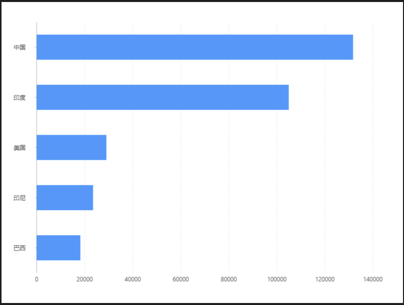

# 基礎條形圖

### 圖片預覽



### 資料源

```javascript
[{
  country: '巴西',
  population: 18203
}, {
  country: '印尼',
  population: 23489
}, {
  country: '美国',
  population: 29034
}, {
  country: '印度',
  population: 104970
}, {
  country: '中国',
  population: 131744
}]
```


### 內距

```javascript
40, 60, 60, 70
```


### 圖 Geom

#### 柱狀圖（ interval ）

| 列表 | 設定值 |
| :--- | :--- |
| 欄位 | country\*population |
| 類型 | 柱狀圖 |


### 極坐標 Coord

| 列表 | 設定值 |
| :--- | :--- |
| 類型 | 直角坐標系 |
| 轉置 | true |




