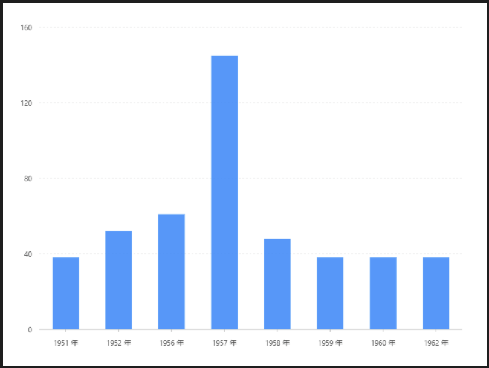

# 基礎柱狀圖

### 圖片預覽




### 資料源

```javascript
[{
  year: '1951 年',
  sales: 38
}, {
  year: '1952 年',
  sales: 52
}, {
  year: '1956 年',
  sales: 61
}, {
  year: '1957 年',
  sales: 145
}, {
  year: '1958 年',
  sales: 48
}, {
  year: '1959 年',
  sales: 38
}, {
  year: '1960 年',
  sales: 38
}, {
  year: '1962 年',
  sales: 38
}]
```


### 內距

```text
40,40,60,60
```


### 圖 Geom

#### 柱狀圖（ interval ）

| 列表 | 設定值 |
| :--- | :--- |
| 欄位 | year\*sales |
| 類型 | 柱狀圖 |




