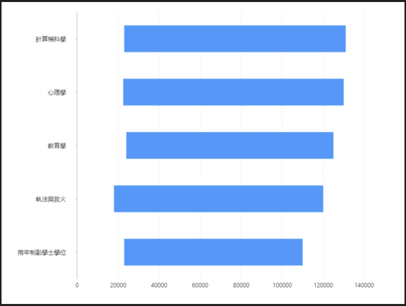

# 區間條形圖

### 圖片預覽



### 資料源

```javascript
[{
  profession: '兩年制副學士學位',
  highest: 110000,
  minimum: 23000,
  mean: 56636
}, {
  profession: '執法與救火',
  highest: 120000,
  minimum: 18000,
  mean: 66625
}, {
  profession: '教育學',
  highest: 125000,
  minimum: 24000,
  mean: 72536
}, {
  profession: '心理學',
  highest: 130000,
  minimum: 22500,
  mean: 75256
}, {
  profession: '計算機科學',
  highest: 131000,
  minimum: 23000,
  mean: 77031
}]
```


### 內距

```javascript
20, 80, 50, 150
```


### 前置處理函數 Transform

#### 數據加工（ map ）

| 列表 | 設定值 |
| :--- | :--- |
| 類型 | 數據加工 |
| 加工函數 | `function callback(row) {   row.range = [row.minimum, row.highest];   return row; }` |


### 圖 Geom

#### 柱狀圖（ interval ）

| 列表 | 設定值 |
| :--- | :--- |
| 欄位 | profession\*range |
| 類型 | 柱狀圖 |


### 極坐標 Coord

| 列表 | 設定值 |
| :--- | :--- |
| 類型 | 直角坐標系 |
| 轉置 | true |





