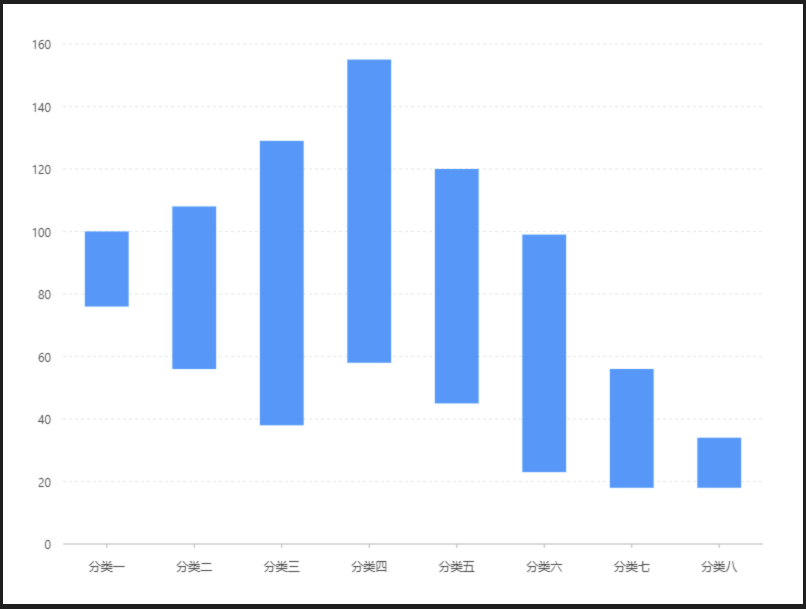

# 區間柱狀圖

### 圖片預覽



### 資料源

```javascript
[{
  x: '分類一',
  y: [76, 100]
}, {
  x: '分類二',
  y: [56, 108]
}, {
  x: '分類三',
  y: [38, 129]
}, {
  x: '分類四',
  y: [58, 155]
}, {
  x: '分類五',
  y: [45, 120]
}, {
  x: '分類六',
  y: [23, 99]
}, {
  x: '分類七',
  y: [18, 56]
}, {
  x: '分類八',
  y: [18, 34]
}]
```


### 內距

```javascript
40, 40, 60, 60
```


### 圖 Geom

#### 柱狀圖（ interval ）

| 列表 | 設定值 |
| :--- | :--- |
| 欄位 | x\*y |
| 類型 | 柱狀圖 |




